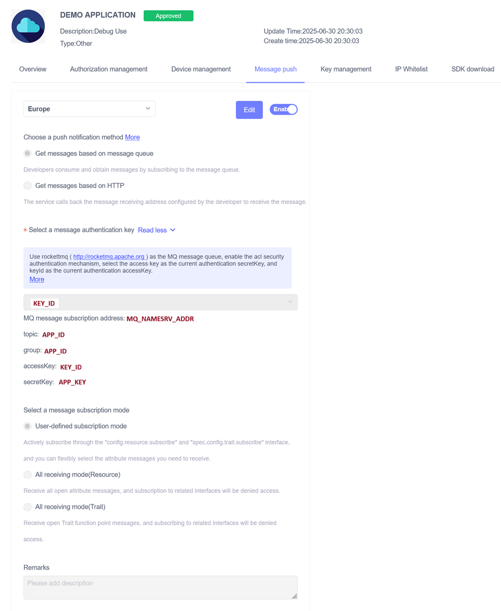

# Aqara RocketMQ Bridge setup

This page shows how to connect Aqara Message Queue Push to Home Assistant with the `aqara-rocketmq-bridge` service and the `ha_aqara_devices` integration.

It covers two supported paths:

| Home Assistant installation | Bridge installation path | Typical integration `Bridge URL` |
| --- | --- | --- |
| Home Assistant Container | Run the bridge with Docker or Compose | `http://aqara-rocketmq-bridge:8080` |
| Home Assistant OS | Install the Home Assistant add-on from this repository | `http://HOME_ASSISTANT_IP:8080` or your reverse-proxy URL |

Useful links:

- Aqara developer console: <https://developer.aqara.com/>
- Aqara Message Push docs: <https://opendoc.aqara.com/en/docs/developmanual/messagePush/messagePushMode.html>
- Bridge repository: <https://github.com/Darkdragon14/aqara-rocketmq-bridge>
- Home Assistant integration repository: <https://github.com/Darkdragon14/ha-aqara-devices>

## How it works
{: #how-it-works }

```text
Aqara RocketMQ -> aqara-rocketmq-bridge -> SSE -> ha_aqara_devices -> Home Assistant
```

The bridge does two things:

- consumes Aqara RocketMQ messages with your Aqara developer credentials;
- exposes `GET /health` and `GET /events` for Home Assistant.

The `ha_aqara_devices` integration remains responsible for Aqara Open API authentication and `config.resource.subscribe` calls.

## What you need before starting

- an account Aqara developer;
- the project `APP_ID`;
- the matching `KEY_ID` and `APP_KEY` from Aqara `Key management` from your region;
- a strong `BRIDGE_TOKEN` that Home Assistant will use for `GET /events`;
- a stable URL or reachable address for the bridge;
- the `ha_aqara_devices` Home Assistant integration.

Most of the Aqara values used in this guide come from the Aqara developer console:

- `APP_ID`: your Aqara project ID;
- `KEY_ID` and `APP_KEY`: from `Key management`;
- `MQ_NAMESRV_ADDR`: from `Message push`.

`BRIDGE_TOKEN` is different: Aqara does not provide it. You choose this secret yourself, and Home Assistant must use the same value to connect to the bridge.

## Step 1 - Create an account Aqara developper

1. Create an account at <https://developer.aqara.com/> and open the console.
2. Copy the project `appId` and save it as `APP_ID`.
3. Open `Key management` and copy the generated `Key ID` and `App Key`.
5. Keep those values safe. You will reuse the same `APP_ID`, `KEY_ID`, and `APP_KEY` in both the bridge and the Home Assistant integration.

## Step 2 - Configure Aqara Message Push

Open your project details and go to `Message push`.

Use these settings:

1. Select the correct Aqara region for your project.
2. Choose `Get messages based on message queue`.
3. Select the same `Key ID` that you want to use for the bridge.
4. Enable push.
5. Keep `User-defined subscription mode`.

Why `User-defined subscription mode` matters:

- the Home Assistant integration subscribes only to the resources it needs;
- the bridge then relays those updates over `/events`.

The values shown by Aqara map directly to the bridge settings:

| Aqara Message Push field | Bridge value |
| --- | --- |
| `MQ message subscription address` | `MQ_NAMESRV_ADDR` |
| `topic` | `APP_ID` |
| `group` | `APP_ID` |
| `accessKey` | `KEY_ID` |
| `secretKey` | `APP_KEY` |

This Aqara admin screen shows where to find the selected `KEY_ID` and the values you need to copy into the bridge: `MQ_NAMESRV_ADDR`, `APP_ID`, `KEY_ID`, and `APP_KEY`.



Do not assume `3rd-subscription.aqara.cn:9876` is your real nameserver. Aqara uses that value as an example in their documentation. The correct `MQ_NAMESRV_ADDR` is the exact value shown in your own `Message push` page.

## Step 3 - Understand `BRIDGE_PUBLIC_URL` vs Home Assistant `Bridge URL`

These two values are related, but they are not exactly the same setting.

| Setting | Where you configure it | What it should contain |
| --- | --- | --- |
| `BRIDGE_PUBLIC_URL` | Bridge environment variable or add-on option | The canonical URL the bridge reports in `/health`. If you expose the bridge through a reverse proxy or tunnel, use that HTTPS URL. Aqara does not send messages to this URL. |
| `Bridge URL` | `ha_aqara_devices` config flow in Home Assistant | The exact URL that Home Assistant can call for `GET /health` and `GET /events`. |

Examples:

- shared Docker network: `http://aqara-rocketmq-bridge:8080`
- Home Assistant OS add-on exposed on the host: `http://HOME_ASSISTANT_IP:8080`
- reverse proxy or Cloudflare Tunnel: `https://bridge.example.com`

If you already have a clean external URL, using the same value in both places keeps the setup easy to reason about.

## Step 4 - Choose your Home Assistant installation type

Use only one of the following paths.

### Path A - Home Assistant Container

Use this path if Home Assistant itself runs in Docker and can reach the bridge over a shared Docker network.

#### 1. Run the bridge container

Example `compose.yaml` service:

```yaml
services:
  aqara-rocketmq-bridge:
    image: ghcr.io/darkdragon14/aqara-rocketmq-bridge:main
    container_name: aqara-rocketmq-bridge
    restart: unless-stopped
    ports:
      - "8080:8080"
    environment:
      APP_ID: your-app-id
      KEY_ID: your-key-id
      APP_KEY: your-app-key
      BRIDGE_TOKEN: change-me
      MQ_NAMESRV_ADDR: your-message-push-nameserver
      BRIDGE_PUBLIC_URL: https://bridge.example.com
    networks:
      - homeassistant

networks:
  homeassistant:
    external: true
```

Aqara does not send messages to `BRIDGE_PUBLIC_URL`. Message delivery comes from RocketMQ, and the bridge consumes that queue directly. `Bridge URL` is the setting that Home Assistant uses to reach `/health` and `/events`.

You can also run the published image directly:

```bash
docker run --rm -p 8080:8080 \
  -e APP_ID=your-app-id \
  -e KEY_ID=your-key-id \
  -e APP_KEY=your-app-key \
  -e BRIDGE_TOKEN=change-me \
  -e MQ_NAMESRV_ADDR=your-message-push-nameserver \
  -e BRIDGE_PUBLIC_URL=https://bridge.example.com \
  ghcr.io/darkdragon14/aqara-rocketmq-bridge:main
```

For `MQ_NAMESRV_ADDR`, copy the exact value shown as `MQ message subscription address` on the Aqara `Message push` page.

#### 2. Pick the integration `Bridge URL`

If Home Assistant and the bridge share the same Docker network, the simplest value is:

```text
http://aqara-rocketmq-bridge:8080
```

That is also the integration default.

#### 3. Verify basic container reachability

Run this from somewhere that can reach the bridge:

```bash
curl http://aqara-rocketmq-bridge:8080/health
```

You should get JSON back from the bridge.

### Path B - Home Assistant OS

Use this path if you run Home Assistant OS and want the bridge as a managed add-on.

#### 1. Add this repository as a third-party add-on repository

1. Open the Home Assistant add-on store.
2. Open the repositories dialog.
3. Add this repository URL:

```text
https://github.com/Darkdragon14/aqara-rocketmq-bridge
```

4. Refresh the store if needed.

#### 2. Install the `Aqara RocketMQ Bridge` add-on

The add-on supports `amd64` and `aarch64`.

Fill the add-on options with the same Aqara project values:

| Add-on option | Value |
| --- | --- |
| `app_id` | Aqara `APP_ID` |
| `key_id` | Aqara `KEY_ID` |
| `app_key` | Aqara `APP_KEY` |
| `bridge_token` | Your chosen SSE bearer token |
| `mq_namesrv_addr` | Copy `MQ message subscription address` from the same Aqara `Message push` page |
| `bridge_public_url` | The stable URL you want to use for the bridge |

Then:

1. Save the configuration.
2. Install the add-on.
3. Start the add-on.
4. Keep port `8080` available so the integration can reach the bridge.

#### 3. Pick the integration `Bridge URL`

For the add-on path, use a URL that Home Assistant can reach on the host, for example:

```text
http://HOME_ASSISTANT_IP:8080
```

If you already expose the bridge through a reverse proxy, use that URL instead.

#### 4. Verify the add-on

From another machine on the same network, try:

```bash
curl http://HOME_ASSISTANT_IP:8080/health
```

If the add-on is running and port `8080` is exposed correctly, the bridge should answer with JSON.

## Step 5 - Install and configure the `ha_aqara_devices` integration

### 1. Install the integration

Recommended path: install it with HACS.

1. Open HACS.
2. Search for `Aqara Devices`.
3. Install it.
4. Restart Home Assistant.

If you prefer manual installation, copy `custom_components/ha_aqara_devices` into your Home Assistant `custom_components` directory and restart Home Assistant.

### 2. Run the config flow

In `Settings -> Devices & Services -> Add Integration`, search for `Aqara Devices`.

The integration asks for these fields:

| Field in Home Assistant | What to enter |
| --- | --- |
| `Aqara account (email or phone)` | Your Aqara login identifier |
| `Region` | The Aqara region that matches your account and project |
| `Bridge URL` | The bridge URL from Path A or Path B |
| `Bridge token` | The same token as `BRIDGE_TOKEN` or `bridge_token` |
| `App ID` | The same Aqara `APP_ID` |
| `App key` | The same Aqara `APP_KEY` |
| `Key ID` | The same Aqara `KEY_ID` |

If your Aqara account region is set to `Other`, that value may not be selectable in the integration. In that case, switch the Aqara account region to another region supported by the Aqara V3 API, as available in the Aqara Developer console, then re-add the affected device in the Aqara Home app before retrying discovery.

### 3. Enter the authorization code

After the first form, Aqara sends a verification code to your email address or phone number.

Enter that code in the `Authorization code` step to finish the config flow.

### 4. What happens after setup

Once the integration starts successfully, it will:

1. validate the bridge with `GET /health`;
2. connect to `GET /events` with `Authorization: Bearer <bridge token>`;
3. call Aqara Open API subscription endpoints in `User-defined subscription mode`;
4. create entities for supported Aqara devices.

## Step 6 - Verify the bridge and the event stream

### Health endpoint

`GET /health` is the quickest check.

```bash
curl http://YOUR_BRIDGE_URL/health
```

Typical fields:

```json
{
  "status": "up",
  "rocketmqEnabled": true,
  "rocketmqStarted": true,
  "lastMessageAt": "2026-04-10T10:00:00Z",
  "publicUrl": "https://bridge.example.com",
  "nameserver": "your-message-push-nameserver",
  "lastError": null
}
```

Interpretation:

- `up`: the RocketMQ consumer is started;
- `starting`: the bridge is up, but RocketMQ is not ready yet;
- `degraded`: RocketMQ was disabled by configuration.

### SSE endpoint

`GET /events` requires the bearer token.

```bash
curl -N \
  -H "Authorization: Bearer YOUR_BRIDGE_TOKEN" \
  http://YOUR_BRIDGE_URL/events
```

Expected behavior:

- the first event is a `snapshot`;
- later updates arrive as batched events;
- heartbeat comments are sent periodically to keep the stream alive.

Example payload:

```json
{
  "type": "snapshot",
  "cursor": 42,
  "events": [
    {
      "type": "resource_report",
      "subjectId": "lumi.xxx",
      "resourceId": "3.51.85",
      "value": "1",
      "time": 1710000000000,
      "statusCode": 0
    }
  ]
}
```

### Home Assistant side

When everything is wired correctly:

- the integration loads without `ConfigEntryNotReady` errors;
- bridge health checks succeed;
- `/events` stays connected;
- entity state changes start to reflect live Aqara updates.

## Troubleshooting

### `GET /health` stays on `starting`

Check these first:

- `APP_ID`, `KEY_ID`, and `APP_KEY` all belong to the same Aqara project;
- `Message push` is enabled in Aqara;
- the selected `Key ID` in `Message push` matches the one used by the bridge;
- `MQ_NAMESRV_ADDR` is correct for your project region.

### `GET /events` returns `401 Unauthorized`

Your Home Assistant integration is using the wrong bridge token. Make sure the integration `Bridge token` matches the bridge `BRIDGE_TOKEN` exactly.

### The integration cannot connect to the bridge

Usually the issue is the `Bridge URL`.

- On Home Assistant Container, prefer the Docker service name on the shared network.
- On Home Assistant OS, prefer the Home Assistant host IP on port `8080`, or your reverse-proxy URL.
- Make sure the URL you enter is the one Home Assistant can actually reach, not just the one your browser can reach.

### No events arrive in Home Assistant

Check all of the following:

- Aqara `Message push` is set to `Get messages based on message queue`;
- subscription mode is `User-defined subscription mode`;
- the integration finished setup and entered the authorization code successfully;
- supported devices are present in the Aqara account tied to the project.

### A device is not discovered when the Aqara account region is `Other`

If your Aqara account region is set to `Other`, that value may not be available in the integration or Aqara project settings. In that case, one or more devices may not be discovered even if the rest of the setup looks correct.

Try this:

- switch the Aqara account region to another region supported by the Aqara V3 API, as available in the Aqara Developer console;
- re-add or reinstall the affected device in the Aqara Home app;
- rerun the integration setup with the matching region.

### The add-on repository does not appear in Home Assistant OS

Refresh the browser and check the Supervisor logs. Home Assistant expects a valid `repository.yaml` at the repository root.

### I want a public HTTPS URL

That works well.

- Put the public URL in `BRIDGE_PUBLIC_URL`.
- Use the same URL as the integration `Bridge URL` if Home Assistant can reach it.
- If you use Cloudflare Tunnel or another reverse proxy, point it to the bridge on port `8080`.
